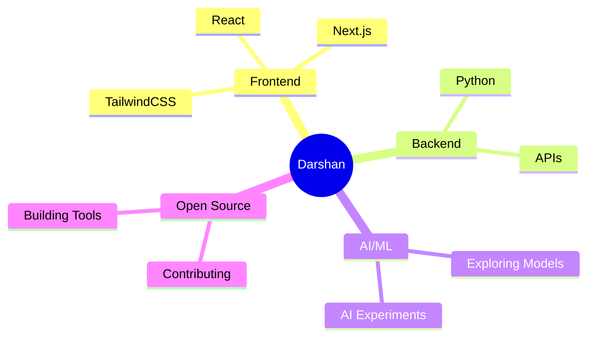

<div align="center">

<!-- Animated Header Banner -->


<!-- Typing SVG -->
<a href="https://git.io/typing-svg">
  
</a>

<br/>

<!-- Profile Views & Social Badges -->
<p>
  
  <a href="https://github.com/DarshanAjudiya7?tab=followers">
    
  </a>
</p>

</div>

---

## 🧠 About Me

```yaml
role       : Frontend Developer & AI Enthusiast
learning   : ["NextJS", "TailwindCSS", "React", "AI/ML", "Python"]
interests  : ["Full-stack Web Dev", "AI/ML Projects", "Problem Solving"]
goal       : "Build impactful projects, contribute to open source, and grow with the tech community"
drives_me  : "Solving real-world problems with code — whether it's an App, a tool, or an AI experiment"
fun_fact   : "Good code is its own best documentation — write it like you're telling a story!"
```

---

## 🛠️ Skills & Tools

<div align="center">

| 🔥 Skill | 📊 Level |
|:---|:---|
| ⚛️ React / TailwindCSS | 🟡 Beginner |
| ▲ Next.JS | 🟠 Intermediate |
| 🌐 HTML5 / CSS3 | 🟢 Pro |
| 🐍 Python | 🟠 Intermediate |
| 🤖 AI / ML | 🔵 Exploring |

</div>

---

## 🚀 Tech Stack

<div align="center">

### 💻 Languages


### ⚡ Frameworks & Libraries


### 🔧 Tools & Platforms


</div>

---

## 🌐 Connect With Me

<div align="center">

[](https://linkedin.com/in/darshan-ajudiya-a5b301310)
[](https://instagram.com/darshan_ajudiya_7)
[](https://x.com/AjudiyaDarshan7)
[](mailto:darshanajudiya07@gmail.com)
[](https://github.com/DarshanAjudiya7)

</div>

---

## 🏆 HacktoberFest 2k25 Rewards & Contribution Graph

<div align="center">

> 🎉 **6 PRs Completed — Mission Accomplished!** 🎉
> 
> 🚀 Proud **Open Source Contributor** 🌍


<!--  -->
[](https://holopin.io/@DarshanAjudiya7)

</div>

---

## 📊 GitHub Stats

<div align="center">


</div>


---

## 🎯 Current Focus

<div align="center">



</div>

---

## 💬 Let's Build Something Together!

<div align="center">

🌐 **My Portfolio:** [live demo](https://github.com/DarshanAjudiya7)

💡 Got a cool project idea or want to collab? Hit me up — I'm always up for a coding adventure! 🚀

⚡ **Fun fact:** I am very funny and smiling person 😄

</div>

---

<div align="center">

### 💡 Quote of the Day

> ⭐ *"Code is like humor. When you have to explain it, it's bad."* — **Cory House** ⭐

<br/>


<br/>

<!-- Footer Wave -->


</div>
